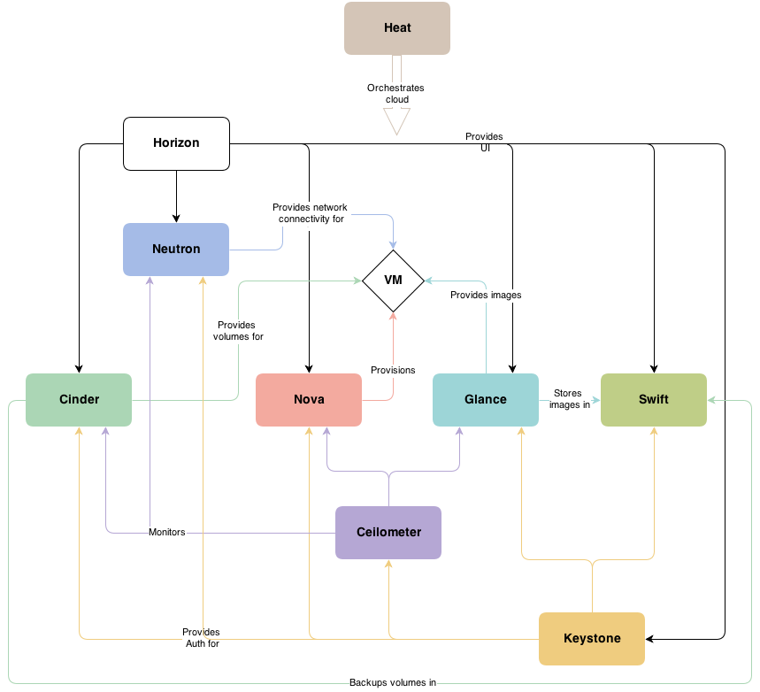

## OpenStack

A ubiquitous OpenSource Cloud Computing platform to meet the needs of
public and private clouds regardless of size, by being simple to
implement and massively scalable.

### Key design goals

#### Scalability

Everything should be shared-nothing and asynchronous

#### ReST

All APIs are ReSTful HTTP/S services

#### 3 sets of Client Tools

Client libraries

CLIs

Unified Dashboard

#### Modularity

